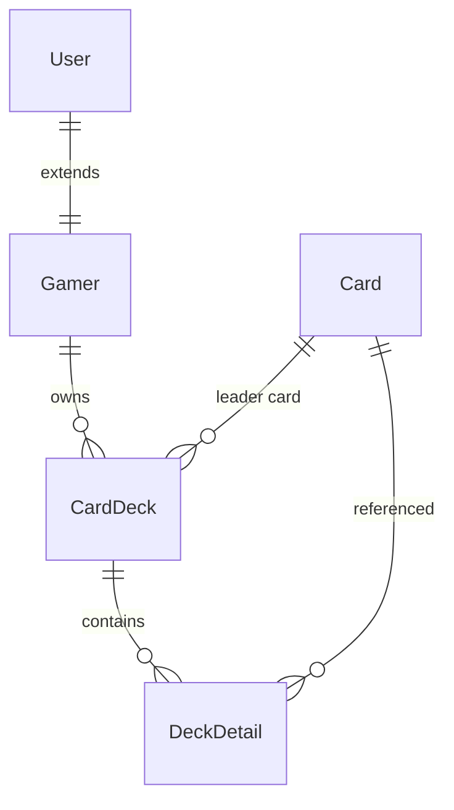

# Lorecraft TCG Lounge - Architecture v1.0

## 📋 개요

Lorecraft TCG Lounge는 **레이어드 아키텍처(Layered Architecture)** 패턴을 채택하여 개발된 Trading Card Game 관리 플랫폼입니다. 

### 아키텍처 결정 배경

- **MSA → 모놀리식 전환**: 초기 도메인 기반 구조(DDD)에서 레이어드 구조로 리팩토링
- **개발 효율성**: 중소규모 프로젝트에 적합한 직관적인 구조
- **Spring Boot 표준**: Spring Boot 프레임워크와 자연스럽게 통합
- **유지보수성**: 명확한 책임 분리와 레이어별 관리

---

## 🏛️ 레이어드 아키텍처 구조

### 전체 패키지 구조
```
com.lorecraft.tcglounge/
├── controller/          # Presentation Layer
│   ├── CardController.java
│   ├── UserController.java
│   └── TestController.java
├── service/             # Business Layer  
│   ├── CardService.java
│   └── UserService.java
├── repository/          # Data Access Layer
│   ├── CardRepository.java
│   └── UserRepository.java
├── entity/              # Data Model Layer
│   ├── Card.java
│   ├── CardDeck.java
│   ├── DeckDetail.java
│   ├── User.java
│   └── Gamer.java
├── dto/                 # Data Transfer Objects
├── config/              # Configuration
│   └── WebConfig.java
└── exception/           # Exception Handling
```

---

## 📑 각 레이어 상세 설명

### 1. Controller Layer (Presentation)
**책임**: HTTP 요청/응답 처리, API 엔드포인트 정의

```java
@RestController
@RequestMapping("/api/v1/cards")
@CrossOrigin(origins = "http://localhost:3000")
public class CardController {
    private final CardService cardService;
    // REST API 메서드들...
}
```

**주요 특징**:
- RESTful API 설계 (`/api/v1/` 접두사)
- CORS 설정으로 프론트엔드 연동
- 단순한 HTTP 요청 처리에만 집중

### 2. Service Layer (Business)
**책임**: 비즈니스 로직, 트랜잭션 관리

```java
@Service
@Transactional
public class CardService {
    private final CardRepository cardRepository;
    
    public Card createCard(String cardName, Card.CardColor cardColor, 
                          Card.CardRarity rarity, Integer cost) {
        // 비즈니스 로직 구현
    }
}
```

**주요 특징**:
- `@Transactional` 어노테이션으로 트랜잭션 관리
- 복잡한 비즈니스 규칙 구현
- Repository 레이어와 연동

### 3. Repository Layer (Data Access)
**책임**: 데이터베이스 접근, CRUD 연산

```java
@Repository
public interface CardRepository extends JpaRepository<Card, Long> {
    List<Card> findByCardNameContaining(String cardName);
    List<Card> findByCardColor(Card.CardColor cardColor);
    // JPA 쿼리 메서드들...
}
```

**주요 특징**:
- Spring Data JPA 인터페이스 기반
- 자동 쿼리 생성 및 커스텀 쿼리 지원
- 데이터 접근 추상화

### 4. Entity Layer (Data Model)
**책임**: 데이터베이스 스키마 매핑, 도메인 객체

```java
@Entity
@Table(name = "cards")
@EntityListeners(AuditingEntityListener.class)
public class Card {
    @Id
    @GeneratedValue(strategy = GenerationType.IDENTITY)
    private Long cardId;
    // 필드 및 관계 매핑...
}
```

**주요 특징**:
- JPA 어노테이션으로 테이블 매핑
- 엔티티 간 관계 정의 (`@OneToMany`, `@ManyToOne`)
- Auditing 기능으로 생성/수정 시간 자동 관리

---

## 🔄 데이터 흐름

```
Client Request → Controller → Service → Repository → Entity
                    ↓           ↓           ↓
              HTTP Response ← Business ← Data Access ← Database
```

### 요청 처리 플로우
1. **Client**: HTTP 요청 전송
2. **Controller**: 요청 파라미터 검증 및 Service 호출
3. **Service**: 비즈니스 로직 실행 및 트랜잭션 관리
4. **Repository**: 데이터베이스 쿼리 실행
5. **Entity**: 데이터베이스 결과를 객체로 매핑
6. **Response**: 역순으로 응답 반환

---

## 🏗️ 설계 원칙

### 1. 단일 책임 원칙 (SRP)
- 각 레이어는 명확한 단일 책임을 가짐
- Controller: HTTP 처리, Service: 비즈니스 로직, Repository: 데이터 접근

### 2. 의존성 방향
```
Controller → Service → Repository → Entity
```
- 상위 레이어는 하위 레이어에만 의존
- 하위 레이어는 상위 레이어를 알지 못함

### 3. 관심사의 분리
- 프레젠테이션, 비즈니스, 데이터 접근 로직 완전 분리
- 각 레이어의 독립적인 테스트 가능

---

## 📊 주요 엔티티 관계



### 핵심 관계
- **User → Gamer**: 상속 관계 (`InheritanceType.JOINED`)
- **Gamer → CardDeck**: 일대다 관계
- **CardDeck → DeckDetail**: 일대다 관계
- **Card → DeckDetail**: 다대다 관계 (중간 테이블)

---

## 🔧 기술 스택 상세

### Backend Core
- **Spring Boot 3.2.1**: 메인 프레임워크
- **Java 17**: 프로그래밍 언어
- **Spring Data JPA**: ORM 및 데이터 접근
- **Hibernate**: JPA 구현체

### Database
- **MySQL 8.0**: 운영 데이터베이스
- **H2**: 개발/테스트 데이터베이스
- **Redis**: 캐싱 (추후 적용)

### Build & Deploy
- **Maven**: 빌드 도구
- **Docker**: 컨테이너화
- **Docker Compose**: 멀티 컨테이너 오케스트레이션

---

## 🚀 장점과 특징

### ✅ 장점
1. **직관적 구조**: 기능별 명확한 분리
2. **쉬운 확장**: 레이어별 독립적인 확장 가능
3. **테스트 용이**: 각 레이어 단위 테스트 가능
4. **표준 패턴**: Spring Boot 생태계와 완벽 호환
5. **신규 개발자 친화적**: 널리 알려진 아키텍처 패턴

### 🔄 미래 확장 계획
- **MSA 전환**: 필요시 도메인별 마이크로서비스 분리
- **Event-Driven**: 비동기 처리를 위한 이벤트 시스템 도입
- **CQRS**: 읽기/쓰기 분리 패턴 적용
- **API Gateway**: 마이크로서비스 통합 관리

---

## 📝 API 설계 가이드라인

### URL 패턴
```
/api/v1/{resource}
/api/v1/cards           # 카드 목록
/api/v1/cards/{id}      # 특정 카드
/api/v1/cards/search    # 카드 검색
```

### HTTP 메서드 사용
- **GET**: 조회 (`@GetMapping`)
- **POST**: 생성 (`@PostMapping`)
- **PUT**: 전체 수정 (`@PutMapping`)
- **PATCH**: 부분 수정 (`@PatchMapping`)
- **DELETE**: 삭제 (`@DeleteMapping`)

### 응답 형식
```json
{
  "success": true,
  "message": "요청 처리 완료",
  "data": { /* 실제 데이터 */ }
}
```

---

## 🔍 개발 가이드

### 새로운 기능 추가 시
1. **Entity 생성**: 데이터 모델 정의
2. **Repository 인터페이스**: 데이터 접근 메서드
3. **Service 구현**: 비즈니스 로직
4. **Controller 생성**: REST API 엔드포인트
5. **테스트 작성**: 각 레이어별 단위 테스트

### 코딩 컨벤션
- **패키지명**: 소문자, 단수형
- **클래스명**: PascalCase
- **메서드명**: camelCase
- **어노테이션**: 기능별 명확한 구분 사용

---

**작성일**: 2025-09-08  
**버전**: v1.0  
**작성자**: Backend Development Team